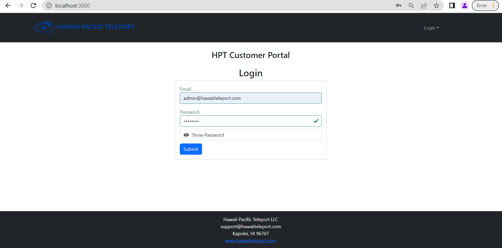
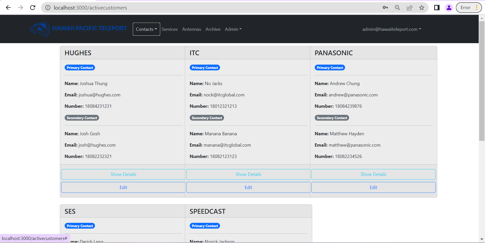
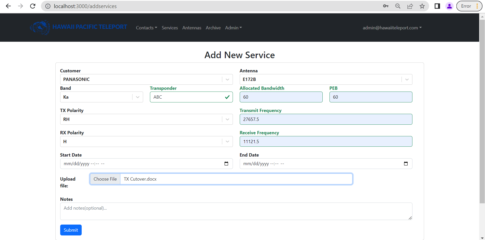
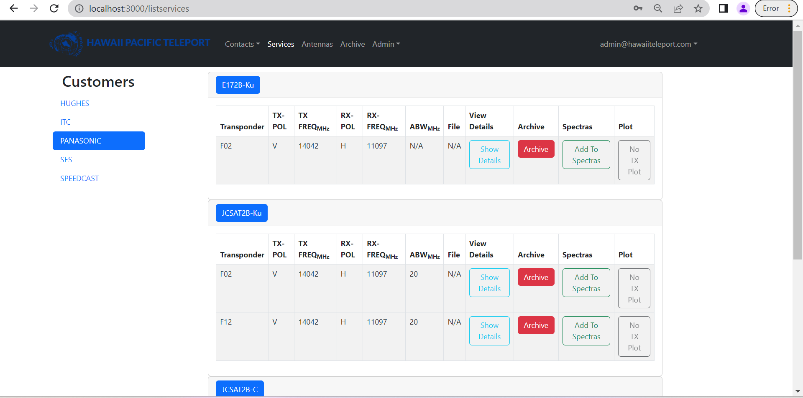
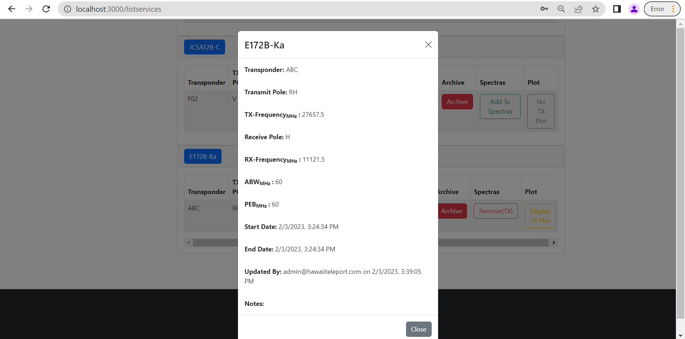
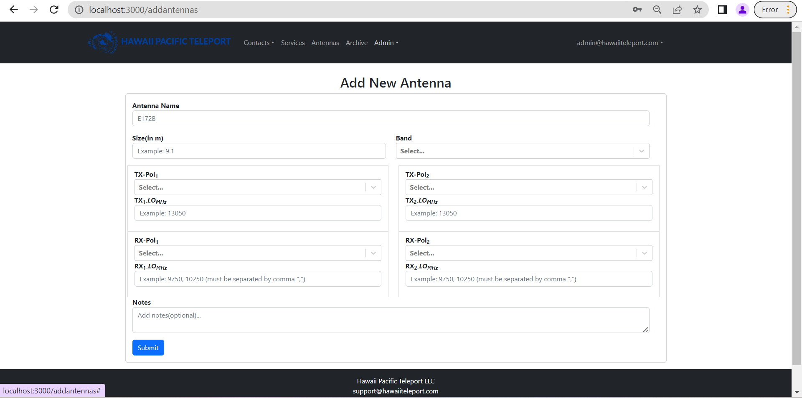
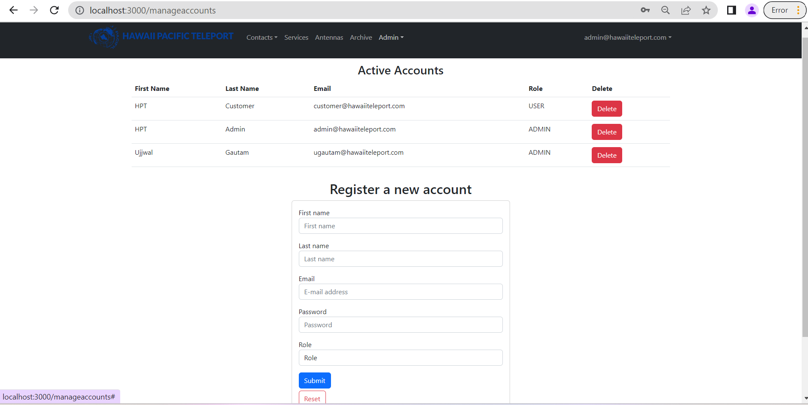
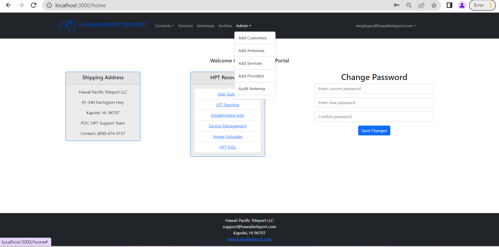

## Overview

**Note** that all of the examples and information displayed in this documentation are made up and do not use actual client information. The documentation guides the users about various aspects of this application. For any questions please contact the developer (Ujjwal)

  
 This application utilizes various technologies, including:

- [Meteor](https://www.meteor.com/) for Javascript-based client and server code implementation.
- [React](https://reactjs.org/) for component-based UI implementation and routing.
- [Bootstrap UI React](https://react-bootstrap.github.io/) CSS Framework for UI design.
- [MongoDB](https://www.mongodb.com/) Production database

 

## Deployment

The application is deployed in the HPT organizations' server and can only be accessible within the local network.

 

## User Guide

This section provides a walkthrough of the HPT Clients Tracker user interface and its capabilities.
  

### Landing Page

The landing page is the first thing the users see upon visiting the root URL of the site.

Users are prompted to enter their username and password for login. Only users with the admin privilege can register new accounts.

 

### Home Page

Upon logging in successfully, the home page is displayed. It contains frequently used information regarding the company and links to other internal websites.

 
 

### Customer Page

The HomePage illustrates the customer dropdown icon in the navigation bar, which includes two options: Active and Inactive customers. Customers with active services hosted at HPT will be classified as Active customers. This page grants users the ability to modify, delete, and review customer information.

 
 

To modify the customer information, select the "Edit" button. This will redirect you to the appropriate page. Utilize the form provided to make the necessary changes. Additionally, users can mark the customer as inactive on this page.

 

### Services Page

Select the "Services" tab on the navigation bar to access a list of active services. This page will only display services associated with active customers. Users can access the active customers on the left sidebar to review the services they are currently running.

**Add Services**
 
To add a new service:
Navigate to the "Services" page and select the "Add Services" button or access it from the "Admin" dropdown in the navigation bar.
Complete the form with the required information, and upload any necessary files if desired.
Once complete, submit the form to finalize the process.

**Individual Service**
 
By selecting the customer button on the left sidebar, the application will display the services associated with that specific customer
 
On this page, users have the ability to view and delete the service. Additionally, users have the option to add the service to Spectras, an external device that is utilized for monitoring services. The application interacts with the device through a REST API. Once added to the Spectras application, users can access the latest graph of the service. This feature allows for quick and efficient monitoring of the service status and aids in troubleshooting during issues and outages.

 
Click on the "Show Details" button to view the service's details.

 
To add the TX/RX services to LPT Spectras, select the "Add to Spectras" button. After successfully adding the service to Spectras, the button label will change to "Remove From Spectras." If you wish to remove the service from Spectras, select the "Remove From Spectras" button.
 
 
Please **note** that the "Delete" button on the service page will delete the service and its associated files from the database and removes the service from Spectras.

 
 

Click on "Display Plot" button to view the latest updated graph of the service.

### Antennas

Select the "Antenna" button on the navigation bar to view, edit, and delete existing antennas.

To add a new antenna, navigate to the "Antenna" page and select the "Add Antenna" button or access it from the "Admin" dropdown in the navigation bar.

 
 

### Admin

The "Admin" dropdown button on the navigation bar provides access to the functionality for adding customers, services, and antennas. Additionally, it includes options for the administrator to manage user accounts and view a list of customers associated with a particular antenna.
 
The "Manage Account" page is accessible only to users with an "Admin" role and allows them to delete/register users. This page is not visible to users with different roles.

 
Users with non-admin role cannot manage accounts

 

The "Get Customers" page enables users to view a list of customers and the services associated with a particular antenna.

 

## Contact Me

**HPT Clients Tracker** is designed, implemented, and maintained by [Ujjwal Gautam](mailto:ujjwalgautam00@gmail.com)

    
